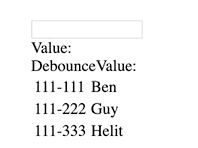

# use-debounce-input

> Hook for debounce inputs and filtering arrays with debounce effect for react

[](https://www.npmjs.com/package/use-debounce-input) [](https://standardjs.com)

## Install

```bash
npm install --save use-debounce-input
```



## Basic Usage

```tsx
import * as React from 'react'
import useDebounceInput from 'use-debounce-input'

const BasicUsage = () => {
  const {
    DebounceInput,
    value,
    debounceValue,
  } = useDebounceInput({
    delay: 400,
  });

  return (
    <div>
      <DebounceInput />
      <br />
      Value: {value}
      <br />
      DebounceValue: {debounceValue}
    </div>
  )
}
```

## Basic Usage With Array
Sometimes you need the input to filter a list by specific properties, in that case you can provide `items` option and `filterByColumns` and then to use `filteredItems`. 
Remember to useMemo in case the creation of the array is inside the component that use the hook

use this options can reduce Ajax/renders when the user typing and try to filter a list

```tsx
import * as React from 'react'
import useDebounceInput from 'use-debounce-input'

const WithArray = () => {
  const items = useMemo(() => [
    { id: '111-111', name: 'Ben' },
    { id: '111-222', name: 'Guy' },
    { id: '111-333', name: 'Helit' },
  ], [])
  const {
    DebounceInput,
    value,
    debounceValue,
    filteredItems
  } = useDebounceInput({
    delay: 400,
    items,
    filterByColumns: ['id']
  });

  return (
    <div>
      <DebounceInput />
      <br />
      Value: {value}
      <br />
      DebounceValue: {debounceValue}
      <br />
      <table>
        {filteredItems.map(filteredItem => (
          <tr>
            <td>{filteredItem.id}</td>
            <td>{filteredItem.name}</td>
          </tr>
        ))}
      </table>
    </div>
  )
}
```

## Custom Filter
For custom filtering you can use `filter` option. The function will get (debounceValue, items, filterByColumns) params and should return newArray of filtered items. the function can be async function

(debounceValue, items, filterByColumns) => newArray

```tsx
import * as React from 'react'
import useDebounceInput from 'use-debounce-input'

const AsyncFilter = () => {
  const [loading, setLoading] = useState(false);
  const items = useMemo(() => [
    { id: '111-111', name: 'Ben' },
    { id: '111-222', name: 'Guy' },
    { id: '111-333', name: 'Helit' },
  ], [])

  const someAsyncSearchMaybeAjax = () => new Promise((resolve) => {
    setLoading(true);
    return setTimeout(() => resolve(new Array(Math.floor(Math.random() * 20) + 1).fill(0).map(() => items[Math.floor(Math.random() * 3) + 0])), 3000)
  }).finally((value) => setLoading(false))

  const {
    DebounceInput,
    value,
    debounceValue,
    filteredItems
  } = useDebounceInput({
    delay: 400,
    items,
    filter: async (value) => {
      const data = await someAsyncSearchMaybeAjax(value);
      return data;
    }
  });

  return (
    <div>
      <DebounceInput />
      {loading ? 'loading...' : undefined}
      <br />
      Value: {value}
      <br />
      DebounceValue: {debounceValue}
      <br />
      <table>
        {filteredItems.map(filteredItem => (
          <tr>
            <td>{filteredItem.id}</td>
            <td>{filteredItem.name}</td>
          </tr>
        ))}
      </table>
    </div>
  )
}

```


## Default filter function
will filter by `filterByColumns` case-insensitive:
```tsx
(debounceValue, items, filterByColumns) => items.filter((item) => {
    return filterByColumns
      .find((column) => String(item[column])
          .toLowerCase().includes(debounceValue.toLowerCase()))
});
```

#### Options:

| option          | default         | description                                                                                   |   |   |
|-----------------|-----------------|-----------------------------------------------------------------------------------------------|---|---|
| delay           | 0               | Debounce timeout in ms.                                                                       |   |   |
| items           | -               | Array that will filtered every time that the `defaultValue` will change by `filter` function  |   |   |
| filter          | defaultFilter | Function that will run once the `defaultValue` changed. more about that in the filter section |   |   |
| filterByColumns | -               | Array of properties to filter by. must when use `items` option                                |   |   |

## License

MIT © [GuySerfaty](https://github.com/GuySerfaty)

---

This hook is created using [create-react-hook](https://github.com/hermanya/create-react-hook).
